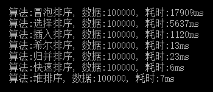

# 算法

> 记录一些自己实现的简单算法

## [排序算法](./排序算法)

1. [冒泡排序](./sort/sort/bubble.c)
2. [插入排序](./sort/sort/insert.c)
3. [希尔排序](./sort/sort/shell.c)
4. [选择排序](./sort/sort/select.c)
5. [快速排序](./sort/sort/quick.c)
6. [归并排序](./sort/sort/merge.c)
7. [堆排序](./sort/sort/heap.c)

  

------

## [搜索算法](./搜索算法)

1. [二分查找](./搜索算法/二分查找.cpp)
2. [哈希表](./搜索算法/哈希表)

------

## [经典面试题](./经典面试题)

1. [树专题](./经典面试题/树专题/树专题.md)
2. [单向链表相交结点](./经典面试题/单向链表相交结点.cpp)
3. [两个树节点的最近公共父结点](./经典面试题/两个树节点的最近公共父结点.cpp)
